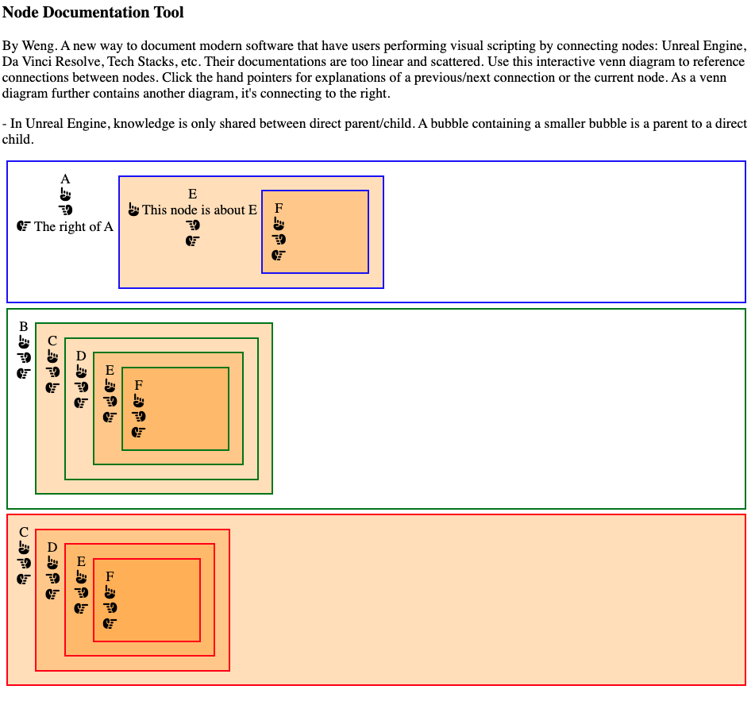
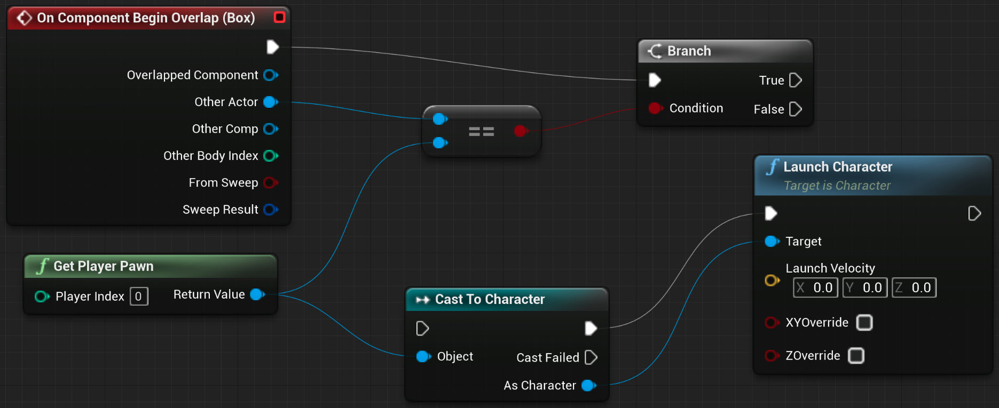
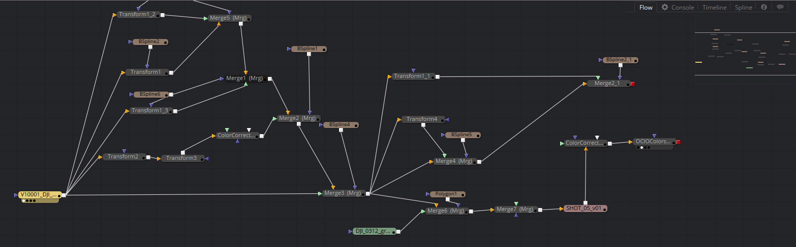

# Node Documentation Tool for Unreal Engine, DaVinci Resolve, Tech Stacks


<a target="_blank" href="https://github.com/Siphon880gh" rel="nofollow"></a>
<a target="_blank" href="https://www.linkedin.com/in/weng-fung/" rel="nofollow"></a>
<a target="_blank" href="https://www.youtube.com/user/Siphon880yt/" rel="nofollow"></a>

## :page_facing_up: Description:
By Weng. A new way to document modern software that have users performing visual scripting by connecting nodes: Unreal Engine, Da Vinci Resolve, Tech Stacks, etc. Their documentations are too linear and scattered. Use this interactive venn diagram to reference connections between nodes. Click the hand pointers for explanations of a previous/next connection or the current node. As a venn diagram further contains another diagram, it's connecting to the right.

Tech Stacks:


## :open_file_folder: Table of Contents:
---
- [Description](#page_facing_up-description)
- [Screenshots](#camera-screenshots)
- [Usage](#runner-usage)
---

## :camera: Screenshots:
From a text file, easily describe different connections for different effects or uses in your software. You can describe left node connections, right node connections, and a general text description of the current node:



You click an icon to expand the hidden text. The text descriptions are all optional.

Above was generated from this text:
```
Node: A
text: This node is about
textLeft: The left node connection is about...
textRight: The right node connection is about...

Node: B
text: This node is about
textLeft: The left node connection is about...
textRight: The right node connection is about...

Node: C
text: This node is about
textLeft: The left node connection is about...
textRight: The right node connection is about...

Node: D
text: This node is about
textLeft: The left node connection is about...
textRight: The right node connection is about...

Node: E
text: This node is about
textLeft: The left node connection is about...
textRight: The right node connection is about...

Node: F
text: This node is about
textLeft: The left node connection is about...
textRight: The right node connection is about...

A -> E -> F
B -> C -> D -> E
C -> F
```

Unreal Engine has poor documentation but expect you to learn nodes:


DaVinci with nodes:


With this tool, you'll have a better way to document the intricacies of nodes than the official documentations.

## :runner: Usage:
Run as index.php file on a PHP server. 

To render a new node documentation, edit test.txt and run test.js (`node test.js`).